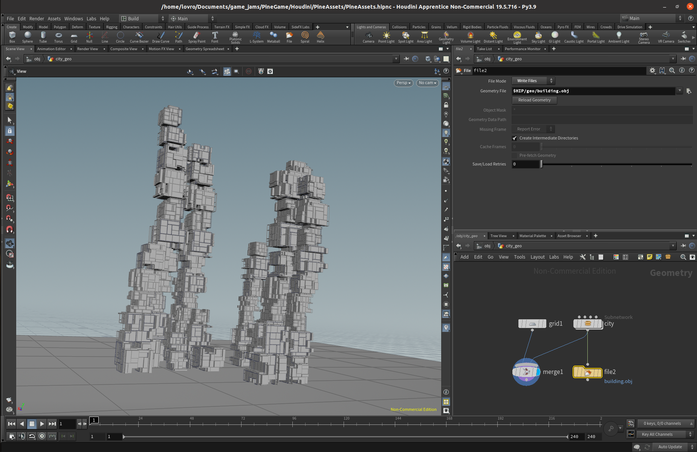
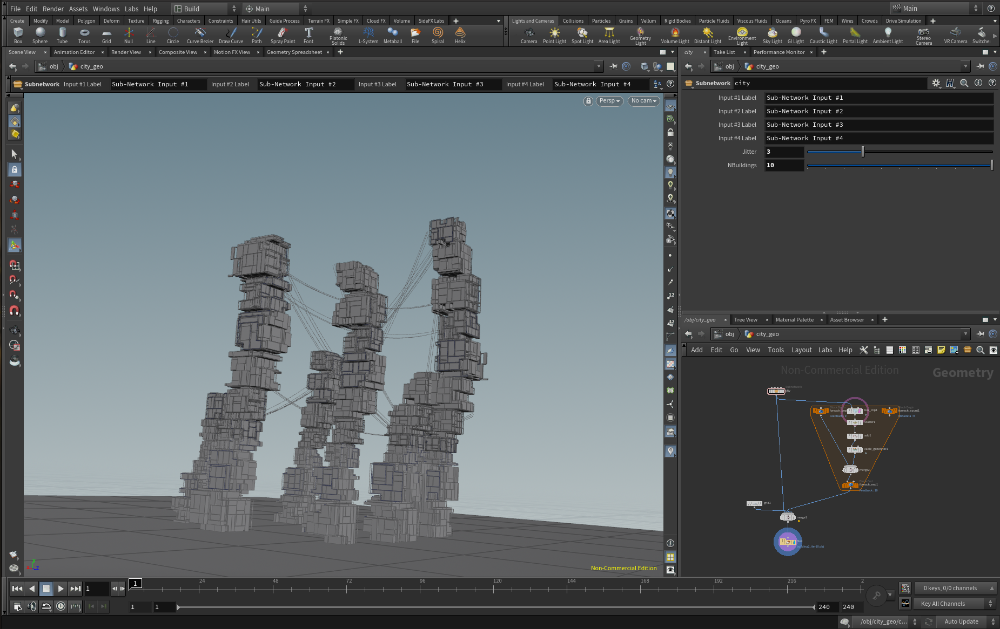

# Procedural Buildings

WIP.

Goal:
* Procedural model in Houdini
* Blender rendering and animation
* Unity interactive environment

Houdini 19.5.716 - Py3.9

## First test in Houdini:

## First test render in Blender:

## Interactive in Unity

TODO
