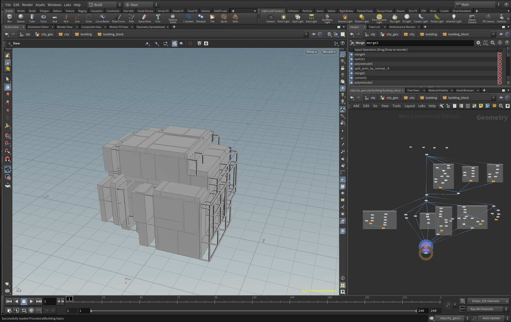
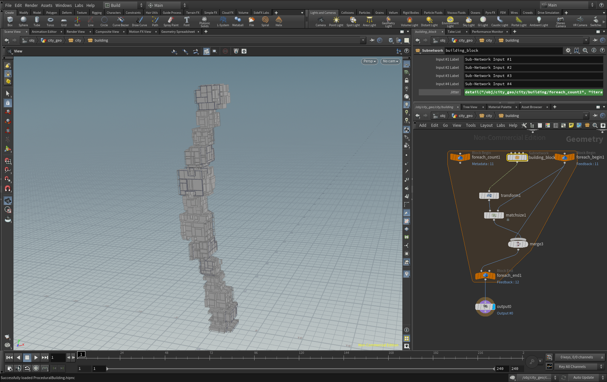
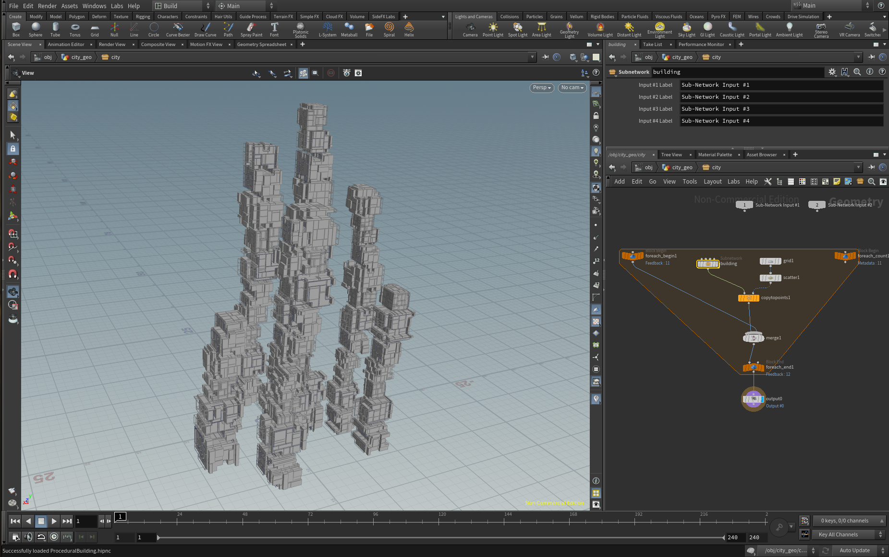
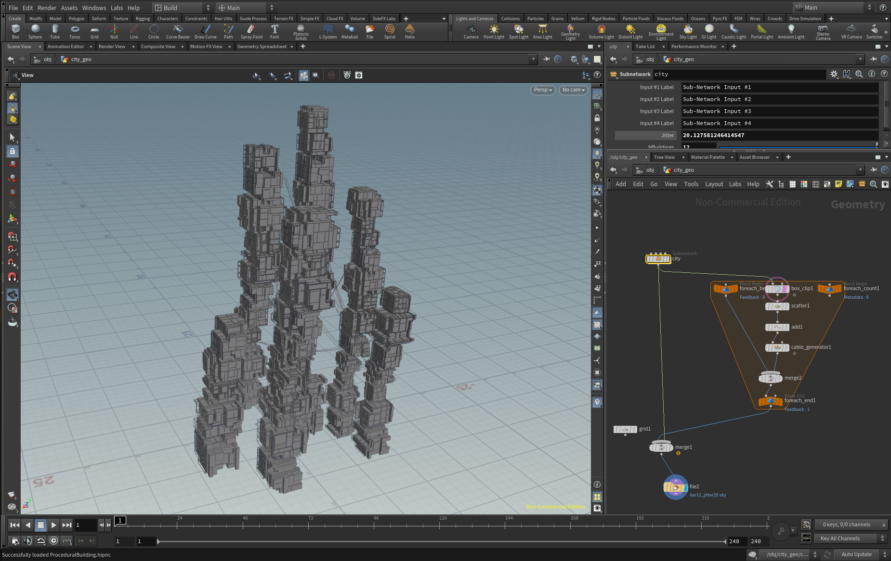
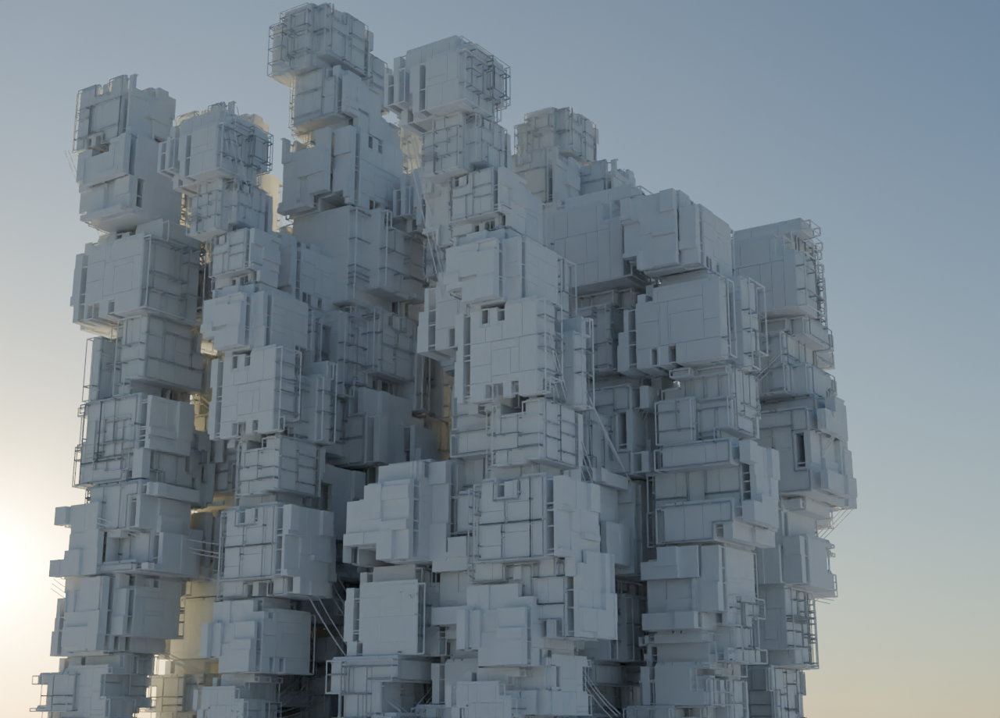
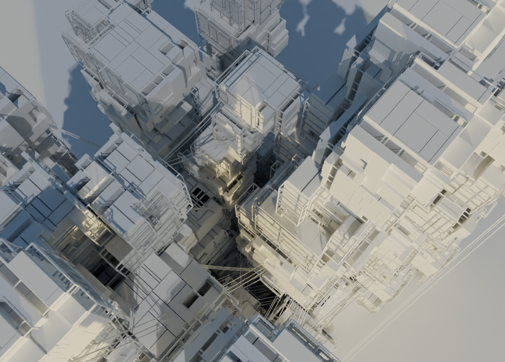
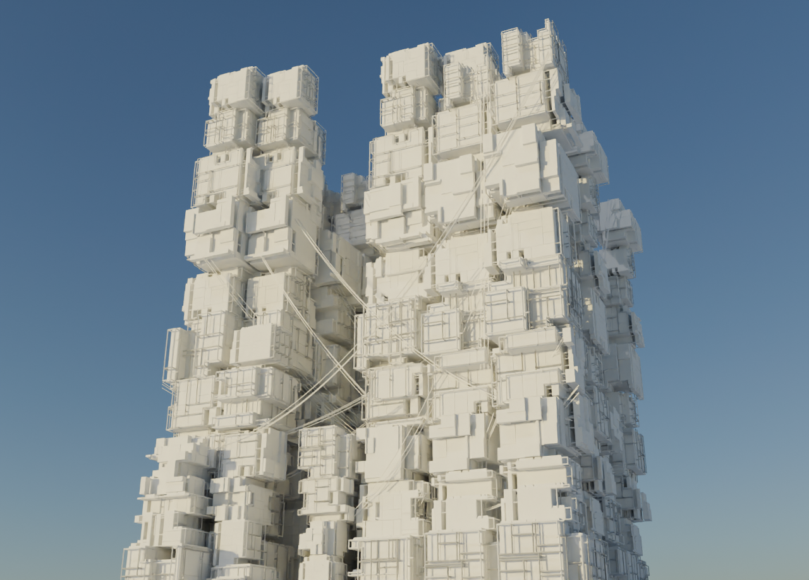
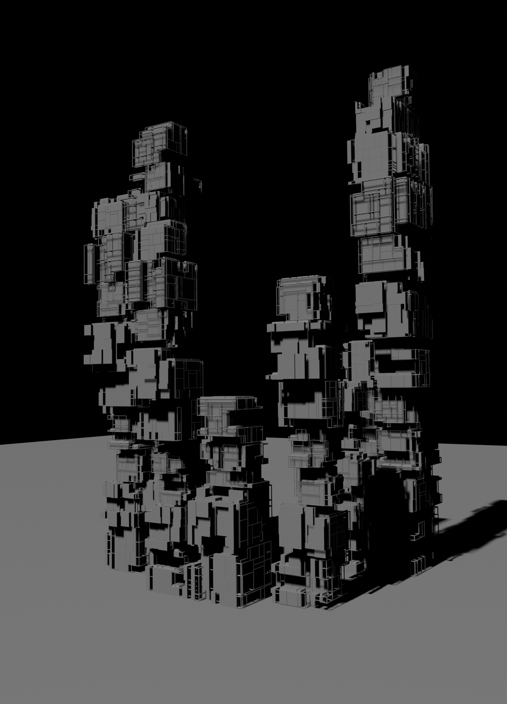
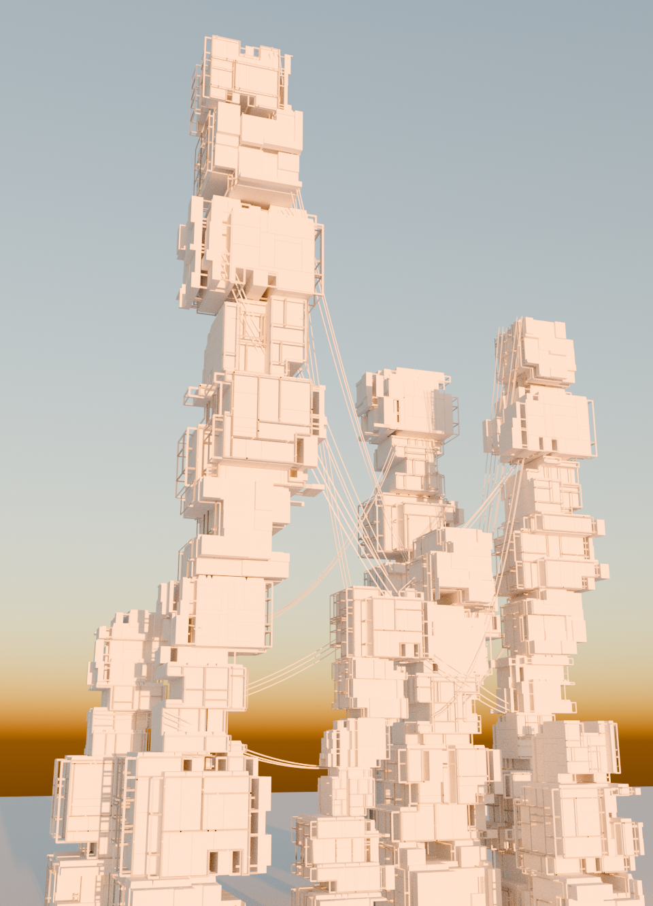
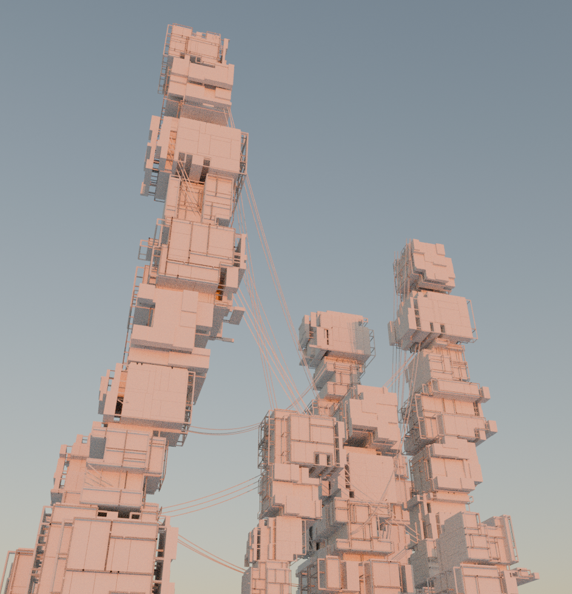

# Procedural Buildings

WIP.

Goal:
* Procedural model in Houdini - DONE!
* Blender rendering and animation - DONE!
* Unity interactive environment - TODO!

Houdini 19.5.716 - Py3.9

More on Artstation: https://www.artstation.com/artwork/EvyJoA

## Procedural modeling in houdini

1. Procedural building block is constructed:

2. Procedural building is constructed using the blocks:

3. Procedural city is constructed using the buildings:

4. Adding cables (Houdini Labs):

## Rendering in Blender

## Interactive in Unity

Generated buildings can be used for environment art in games.

TODO
